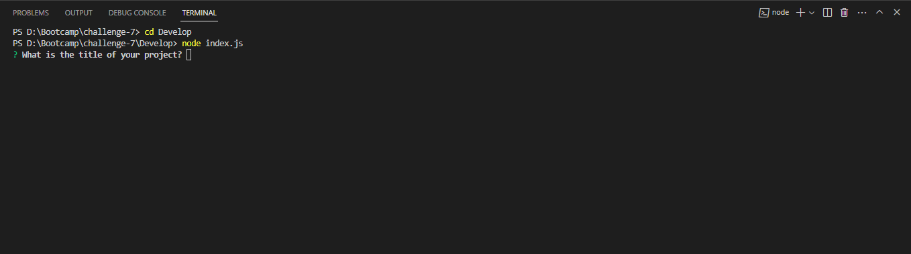
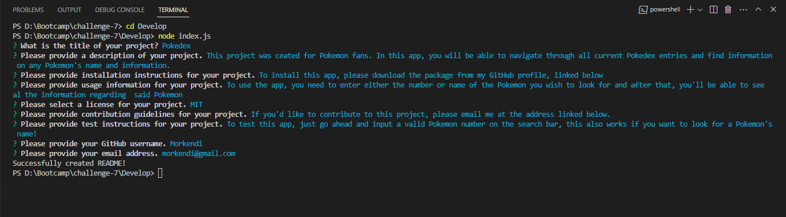
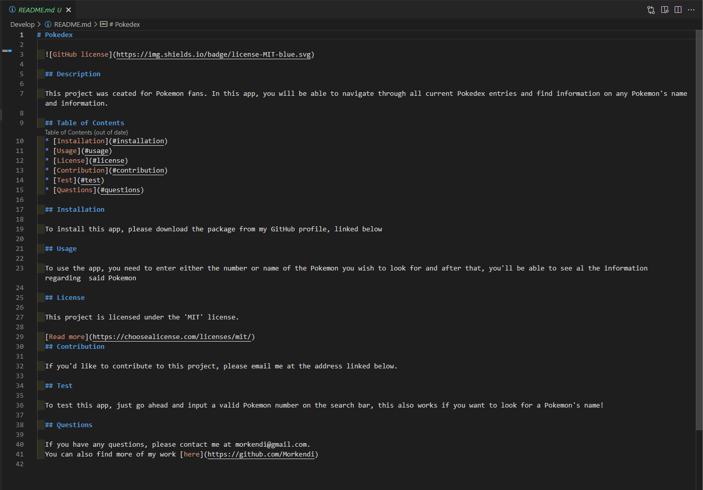

# README Generator

## Description
Every professional-grade project needs a README file to accompany it. A README file allows any user to understand the purpose for building said project, instructions on how to install and use the program, installation guides, etc.

However, writing README files can be a tedious process, which is why this project was created. This project allows you to use a set of CLI prompts to automatically generate a professional README, complete with license information and a table of contents, complete with working links for everything!

## Usage
**Note: In order to use this application, you need to install Node.js version 16 and npm inquirer version 8.2.4**.

To run the application, navigate to the *Develop* folder and run the following command from the command line interface (CLI)

`node index.js`

Once you run the previous command, a series of prompts will appear asking for information that will appear in the README file.

After all prompts are answered, a new `README.md` file is generated.

## Mock Up

--- 

## Credits
- Code by: Daniel Sanchez (https://github.com/Morkendi)
- Starter Code by: TEC Bootcamp (https://github.com/coding-boot-camp/potential-enigma)

## Links
- Link to GitHub repo: (https://github.com/Morkendi/README-Generator)